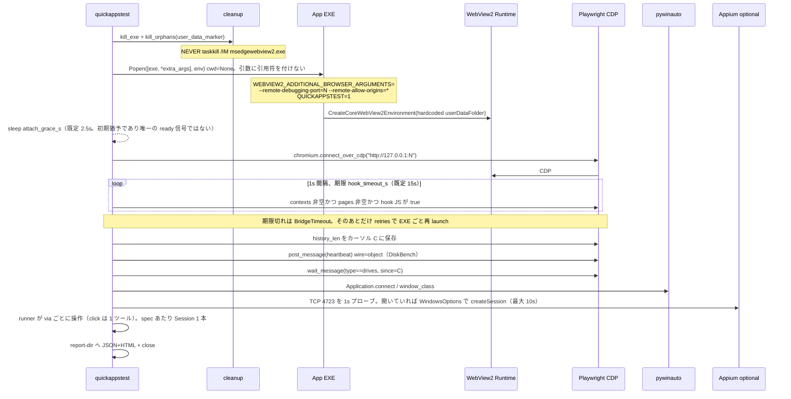
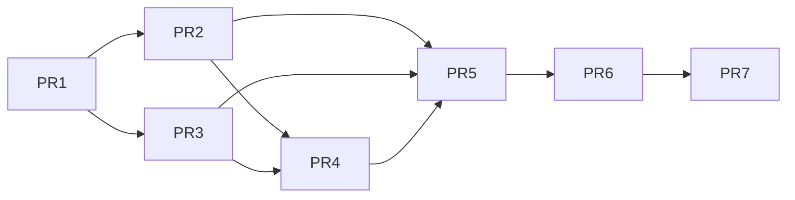

# QuickAppsTest 設計書 — Quick シリーズ共有 UI/挙動テスト基盤

[English] 本設計書は日本語のみ（v1）。識別子・API・ファイルパス・プロトコルフィールド名は英語のままにする。

| 項目 | 値 |
| --- | --- |
| 文書タイトル | QuickAppsTest Design |
| リポジトリ | `QuickAppsTest` |
| 作者 | maktak-105（GitHub: https://github.com/maktak-105） |
| 日付 | 2026-08-23 |
| 版 | v1.0.0 |
| 状態 | Draft |
| ライセンス | MIT |
| 想定読者 | じゅーごさん。実装するエンジニアがこの文書だけで着手できること |

**最終方針（2026-08-23）:** 検査プログラムは Python。ツールは **Playwright + pywinauto + Appium** の三層。同一コントロールを三ツールで**クリック**しない（読み取り oracle の重複は可）。Selenium / msedgedriver は一次スタックではない。

**方針転換（同日、ユーザー）:** 製品の売りと沈黙バグリスクがあるものはアプリを触らない。FolderSize の UAC は残す（検査ランナーを昇格）。**既存 WebMessage キーも揃えない**（検査 YAML が現行 payload を送る）。Must の正は `quick-app-template/10_検査容易性ルール.md`。新規アプリだけ `type` オブジェクト。

---

## Overview

Quick シリーズはハイブリッド UI である。5 本の C++/WebView2 アプリは HTML のボタン・メニュー・`data-i18n` を Chromium 内に持ち、ファイル選択だけ Win32 ダイアログに出す。QuickImageView は WebView2 を使わず、`CreateMenu` / `TrackPopupMenu` / `GetOpenFileNameW` のネイティブ Win32 である。エンジンテスト（`engine_tests.cpp`）は GUI を見ない。GUI QA は QuickMarkPDF の Selenium クライアントと QuickImageView の `tests/ui_test.py`（pywinauto）に閉じている。

**QuickAppsTest は出荷用 GUI EXE ではない。** Python パッケージ `quickappstest` が単一 facade `Session` を提供し、YAML spec の `via:` でバックエンドを振り分ける。

| 層 | ツール | 見るもの |
| --- | --- | --- |
| HTML / DOM / WebMessage | **Playwright** `chromium.connect_over_cdp` | WebView2 内のボタン、HTML メニュー、i18n、About |
| ネイティブ Win32 | **pywinauto** | 窓クラス/タイトル、`CreateMenu`、`#32770`、「ダイアログが出た」 |
| OS アクセシビリティ | **Appium** Windows Driver | Name/AutomationId の発見、ツリー dump、Inspector。実行時にサーバが居なければ SKIP |

v1 の参照は 2 本だけ。WebView2 は **QuickDiskBench**（UAC なし、ファイルダイアログなし、`AreDevToolsEnabled` 未設定）。ネイティブは **QuickImageView**（既存 pywinauto 実績）。残り 4 アプリは契約表と後続 spec の対象であり、v1 で全部は回さない。

---

## Background & Motivation

### 現状 — リポジトリ実体

template（`f:\project\quick-app-template\01_フォルダ構成.md`）は `exe + engine_x64.dll + index.html` のフラット配布を仮定する。実アプリはそれと一致しない。テスターは template レイアウトを前提にしてはならない。

| アプリ | ホスト | HWND クラス | user-data（ハードコード） | HTML の載せ方 | DevTools |
| --- | --- | --- | --- | --- | --- |
| Quick7Zip | `core/native/webview_main.cpp` | `Quick7ZipWindow` 620×700 | `%LocalAppData%\Quick7Zip\WebView2` | RCDATA 201 `NavigateToString`（実行時 sidecar なし） | **`AreDevToolsEnabled(FALSE)`** |
| QuickDiskBench | `core/native/webview_main.cpp` | `QuickDiskBenchNativeWebView2Class` 900×780 | `%TEMP%\QuickDiskBench_WVData2` | `NavigateToString`。ライブは **`dist/binary/index.html`（bundle_html 済み）必須**。`templates/index.html` は相対 `app.js` が解決せず使えない | 無効化していない（コンテキストメニューのみ OFF） |
| QuickFolderSize | `core/native/webview_main.cpp` | `QuickFolderSizeNativeWebView2Class` 1200×720 | `%TEMP%\QuickFolderSize_WVData` | 同上（バンドル済み sidecar） | 無効化していない。**`EnsureAdministrator` / runas** |
| QuickFileCopy | `core/native/src/webview_main.cpp` | `QuickFileCopyNativeWebView2` | `%TEMP%\QuickFileCopy_WebView2` | RCDATA 201 | **`AreDevToolsEnabled(FALSE)`** |
| QuickMarkPDF | `core/native/webview_main.cpp` | `QuickMarkPDFWebViewHost` | `%TEMP%\QuickMarkPDF_WVData` | **唯一 `Navigate(file://index.html)`** + `vendor/` | 無効化していない。`QUICKMARKPDF_OFFSCREEN` |
| QuickImageView | `core/native/main.cpp` | `QuickImageViewWindow` | なし（WebView2 なし） | なし。WIC + Win32 | — |

全 WebView2 ホストは `LoadLibrary(WebView2Loader.dll)` + `CreateCoreWebView2EnvironmentWithOptions(..., environmentOptions=nullptr)`。ホストオブジェクトもカスタムスキームも無い。通信は WebMessage のみ。ファイル選択は `IFileOpenDialog` / `GetOpenFileNameW`（DiskBench はファイルダイアログ自体が無い。CSV は Blob ダウンロード）。

Playwright 公式は `WEBVIEW2_USER_DATA_FOLDER` でテストごとに隔離する。本シリーズは **user-data パスをホストがハードコード**しているため、その env は無視されうる。掃除は各ホストのフォルダ名部分文字列で行う。

### メッセージ形がアプリごとに違う（単一パーサ禁止・wire も違う）

`post_message` はキーだけでなく **JS の wire 形**（object vs string）をアプリごとに選ぶ。MarkPDF 専用の「JSON 文字列を `postMessage`」を全ホストに使うと、FolderSize / FileCopy / 7Zip の `get_WebMessageAsJson` + `"cmd"` 探索が **エスケープされた引用符に当たり沈黙 no-op** する。

| アプリ | JS→C++ 受信 | C++→JS | リクエストキー | ハートビート send | 応答 | **wire（ライブラリが post する形）** |
| --- | --- | --- | --- | --- | --- | --- |
| Quick7Zip | `get_WebMessageAsJson` / `JsonString` | AsJson | `type` | `{type: initialize}` | `initialized` | **object**（`app.js` と同じ） |
| QuickDiskBench | AsJson。**部分文字列** `find(L"get_drives")` の次が `find(L"start")` | AsJson | `action` | `{action: get_drives}` | `type: drives` | **object** |
| QuickFolderSize | AsJson / `ExtractJsonString(..., L"cmd")` | AsJson | **`cmd`（`action` ではない）** | `{cmd: get_drives}` | `type: drives` | **object** |
| QuickFileCopy | AsJson / `json_string(..., L"command")` | `{version:1, event, payload}` | `command` | `{version:1, command: getState}` | `event: selection` | **object** |
| QuickMarkPDF | **文字列** `extract_type` が `"type":"` リテラル | **AsString** | `type` | `{type: get_state}` | `document_state` | **string**（`JSON.stringify` 相当） |

`window.__qa` フックは `event.data` が string でも object でも積む。MarkPDF の `JSON.parse` 専用フックをコピーしてはならない。`adapters/webmessage.py` が `wire` + キーで heartbeat を組み立てる。

### 痛み

1. GUI 回帰がアプリローカル。DiskBench / 7Zip / FolderSize / FileCopy に共有検査が無い。
2. QuickMarkPDF `python/qa/selenium_client.py` の Selenium + msedgedriver は **Runtime とドライバの版一致**が毎回詰まる。Playwright の `connect_over_cdp` はそのファイルを不要にする。
3. WebView2 の HTML ボタンは UIA ツリーでは **一つのペイン**に見える。Appium / pywinauto で `#btn-lang` はクリックできない。
4. QuickImageView は Playwright で駆動できない。既存 `tests/ui_test.py` は pywinauto で `menu_select("編集->リサイズを指定...")` と `#32770` を既に叩いている。
5. `taskkill /IM msedgewebview2.exe` は Teams を落とす（実証済み）。孤児 WebView2 が user-data / CDP ポートを握ると、窓は出てもブリッジが沈黙する。
6. ネイティブファイルダイアログの SendKeys 自動化は `CPP_PORT_POSTMORTEM.md` で失敗済み。「ファイル選択ダイアログの自動操作に依存した検証をしない」。
7. Chromium `Runtime.evaluate` の高速ポーリングはレンダラを飢餓させ `postMessage` を止める。Playwright locator の auto-wait は使ってよい。`page.evaluate` の密ループは 1s 未満禁止。
8. compact JSON は **MarkPDF `extract_type`（`L"\"type\":\""`）だけがスペースで沈黙 no-op**。FolderSize / FileCopy / 7Zip は `:` 後の空白を飛ばす。DiskBench の地雷は空白ではなく **`find(L"start")` の貪欲マッチ**（payload に `start` 部分文字列があると誤ってベンチ開始）。ライブラリは常に compact を出す（無害）。DiskBench adapter は `action` 値に `start` を含むメッセージを v1 で送らない（本物の `action:start` は破壊的で禁止）。
9. FolderSize の `requireAdministrator` は製品の売り（NTFS `$MFT` 直読み）。外さない。未昇格 `Popen` はマニフェストまたは `EnsureAdministrator` の `runas` で **別 PID** になり CDP が空振りする。検査は **ランナー自身を先に昇格**する。`requires_elevation: true` なら Popen 前に TokenElevation。未昇格は `LaunchError`。EXE への `ShellExecute runas` も UAC 自動クリックもしない。
10. 7Zip / FileCopy は `AreDevToolsEnabled(FALSE)`。これは **ページ内 DevTools UI（F12）を切る設定**であり、`--remote-debugging-port` による CDP を必ず拒否するかは **未検証**。MarkPDF は DevTools 無効化なしで CDP を使っている。v1 はリスク回避でこの 2 アプリをライブ対象外にする。ホスト改修（`QUICKAPPSTEST=1` で DevTools を残す）は **スパイクで CDP が落ちてから**検討する。事実上必須と書かない。

### 先行実装から残す教訓（スタックは捨てる、制約は残す）

出典: `QuickMarkPDF/python/qa/selenium_client.py`、`webview_main.cpp`（`g_startup_paths` / `QUICKMARKPDF_OFFSCREEN`）、`CPP_PORT_POSTMORTEM.md`、`QuickImageView/tests/ui_test.py`、Playwright WebView2 公式 https://playwright.dev/python/docs/webview2

残す:

1. EXE は自前 `Popen`。cwd を exe ディレクトリにしない。
2. `WEBVIEW2_ADDITIONAL_BROWSER_ARGUMENTS=--remote-debugging-port=N --remote-allow-origins=*`。
3. user-data フォルダ名がコマンドラインに含まれる PID だけを落とす。**`taskkill /IM msedgewebview2.exe` 禁止。**
4. compact JSON（`separators=(",", ":")`）。
5. `window.__qa` フック（app.js IIFE は外から見えない）。
6. テストモード env でレジストリ読み書きを飛ばす（MarkPDF `QUICKMARKPDF_OFFSCREEN`）。不可視化は画面外座標ではなく layered alpha=0（画面外は DWM がブリッジを絞る）。
7. ファイルオープンは CLI パス / DOM 入力 / `setSource`。ダイアログ完走に依存しない。
8. ImageView の pywinauto パターン（`class_name`、`menu_select`、`#32770`、`control_id`）はライブラリへ。OCR / `visual_difference_score` はアプリローカルのまま。

捨てる: Selenium、`msedgedriver.exe`、Edge WebDriver `use_webview` attach、raw CDP WebSocket クライアント。

---

## Goals & Non-Goals

### Goals（v1）

- Python パッケージ `quickappstest` と CLI `python -m quickappstest --spec ... --exe ...`。
- `Session` facade。バックエンドは Playwright（必須）、pywinauto（必須）、Appium（実行時 optional）。
- YAML spec が `via:` と locator を持つ。未指定時は locator 種から推論。
- 検査カテゴリ: `structural` / `behavioral` / `i18n` / `protocol` / `native`。
- oracle は DOM、WebMessage 履歴、Win32 窓/メニュー状態、（Appium）アクセシビリティ Name。pixel-diff は共有コアの合否に使わない。
- JSON + HTML レポート。
- アプリ検査可能契約を `document/spec` に固定。
- ライブラリ pytest は **ライブ EXE なし**で緑。
- ライブ example spec は **QuickDiskBench（Playwright）** と **QuickImageView（pywinauto + Appium dump）** の 2 本。v1 の YAML は **本リポジトリ `examples/` のみ**。DiskBench / ImageView の `python/qa/` には書かない。
- 消費: `pip install -e f:\project\QuickAppsTest`。`--spec` は `examples/.../spec.yaml` を指す。

### Non-Goals（v1）

- ユーザー向け `QuickAppsTest.exe`。
- 同一コントロールを三ツールで**クリック**して「三重一致」を合格条件にすること。読み取り oracle の重複（Win32 タイトルと Appium Name）は可。
- `IFileOpenDialog` / `GetOpenFileNameW` の完走自動化。許可するのは `dialog_appeared`（`#32770` が見えた）まで。
- pixel-diff / RapidOCR を共有ライブラリの主判定にすること（ImageView `ui_test.py` の `visual_difference_score` はアプリに残す）。
- Selenium / msedgedriver を依存に残すこと。
- Playwright のブラウザバイナリ取得（`playwright install`）。CDP 接続先は WebView2 Runtime。
- QuickMarkPDF `python/qa` 全体の移行（TCP test API、HSV、ダッシュボード）。後続 PR。
- 6 アプリ全部のライブ spec。
- 全 `msedgewebview2.exe` の一括 kill。
- template の `core/native` / `bundle_html.py` / `engine_x64.dll` 前提。
- DiskBench `#btn-start` による実ディスクベンチ（破壊的）。`--test-run` も実 I/O であり GUI 検査ではない。
- Appium サーバ必須化。落ちていれば `via: appium` は SKIP。ライブラリは落ちない。

---

## Proposed Design

### 三層の役割分担（同一クリック禁止）

```
YAML spec  →  quickappstest.Session
                 ├─ Playwright  chromium.connect_over_cdp  → WebView2 HTML/DOM
                 ├─ pywinauto   UIA/win32                  → native window/menu/dialog
                 └─ Appium Windows Driver                  → OS accessibility tree / Inspector
```

| 表面 | ツール | 理由 |
| --- | --- | --- |
| HTML ボタン、HTML メニュー、`data-i18n`、About/Help overlay、パス入力、JS イベント、WebMessage | **Playwright** | 公式 WebView2 経路。locator / tracing / screenshot。msedgedriver の版合わせが無い |
| ネイティブ Win32 メニュー（`CreateMenu` / `TrackPopupMenu`）、`#32770`、窓タイトル/クラス、MessageBox、「ダイアログが出た」 | **pywinauto** | `QuickImageView/tests/ui_test.py` で実証済み。Win32 には Appium より部品が少ない |
| トップレベル窓の Name 発見、アクセシビリティツリー dump、Appium Inspector | **Appium** | ユーザー指定。WebView2 の HTML クリックには使わない。UIA は WebView2 HWND を一枚のペインと見る。ImageView の `#32770` は UIA から見えるが **v1 は dump のみ（クリックしない）** |

**クリック vs 読み取り:** ハードルールは「同一コントロールを二ツール以上で **click / menu_select / type** しない」。同じトップレベル窓の **読み取り**（pywinauto `title_re` と Appium `accessibility_name` contains）は許可する。DiskBench ではこれが劇場ではない。HTML `<title>` は `QuickDiskBench v2.1.1 - Storage Benchmark`、Win32 タイトルは `QuickDiskBench v2.1.1 - Native Storage Benchmark (Cache Modes & Statistics)` で **文字列が違う**。pywinauto は後者、Playwright `document.title` は前者。Appium Name は Win32 タイトル側の読み取り重複であり、Inspector 経路の dogfood として SKIP 可能な check に留める。

**正直な制約（隠さない）:** `appium-windows-driver` は内部で **Microsoft WinAppDriver** をプロキシする。WinAppDriver はほぼメンテ停止で、多くの環境で **Developer Mode** が要る。

**v1 の Appium 起動経路は一つだけ（A）:** オペレータは **Appium 2 だけ**を `http://127.0.0.1:4723` で立てる（`appium`、windows driver インストール済み）。WinAppDriver を手で 4723 に Listen させない。windows driver が WinAppDriver を **子プロセス**として `systemPort` **4724**（既定）で起動する。両方を 4723 にすると衝突し、PR4 の「サーバ有りなら pass」が再現できない。経路 B（WinAppDriver 直結 + `/wd/hub`）は v1 に入れない。

クライアントは `Appium-Python-Client>=3.0` の **`WindowsOptions`**（raw `desired_capabilities` dict を `Remote(url, caps)` に渡さない）。URL は **`http://127.0.0.1:4723`（`/wd/hub` なし）**。TCP で 4723 が閉じていれば **1s で fail-fast** → `self.appium = None`。ポートが開いていれば `createSession` は **最大 10s**。失敗・Developer Mode 不足なら `via: appium` は **SKIP**。Playwright / pywinauto は続行する。HWND の `0x` 有無は WinAppDriver 版でスパイクし、environment.md に固定する。

### 起動シーケンス（WebView2）

Playwright 公式 fixture と同じ。Selenium attach ではない。



ImageView（Playwright なし。**`--ui-test-hidden` は渡さない**）:

```text
subprocess.Popen([exe, expanded_png], env=..., cwd=None)
  # 引用符は付けない。スペースを含むパスはリスト argv がそのまま扱う。
  # ui_test.py 245 の Application.start(f'"{exe}" "{image}"') は
  # 「画像パスを argv[1] で渡す」点だけ同じ。文字列結合をコピーしない。
  → pywinauto Application.connect(process=proc.pid, backend="win32")
  → HWND を 8 桁 hex にして Appium appTopLevelWindow（任意）
```

`--ui-test-hidden` はホストの自己テストで、画像ロード後に UI スレッドで `ShowResizeDialog` を **同期的に 2 回** 開く（`main.cpp` 1557–1611）。Session が `menu_select` する前に `#32770` で止まる。v1 は渡さない。

### ルーティング規則

YAML に `via:` があればそれを使う。無ければ:

| locator キー | 推論 |
| --- | --- |
| `locator`（CSS / Playwright 文字列）、`post`、`eval_js`、`expect_type` | playwright |
| `class_name`、`title_re`、`menu_select`、`control_id`、`dialog_class` | pywinauto |
| `accessibility_name`、`automation_id`、`dump_tree` | appium |

一つの check に複数 `via` を並べない。必要なら check を分ける。click / menu_select / type は check 間でも同じコントロールを二ツールで駆動しない。読み取り（exists / title / dump）の重複は可。

**backends のマージ（1 Session / 1 spec 実行）:**

1. `app.backends` があればそれを使う。無ければ `["playwright", "pywinauto", "appium"]`。
2. CLI `--skip-appium` はリストから `appium` を除く。
3. `playwright` がリストに無い（ImageView）なら CDP env を付けず `connect_over_cdp` しない。
4. 未知の `via:` は **SKIP**（SpecError にしない）。バックエンドモジュール未実装の PR 順でも runner が落とさない。
5. チェック間で EXE を再起動しない。i18n が `currentLang` を変えたら **その check の teardown で戻す**。後続が ja 前提を持てるようにする。

### 参照アプリ

**WebView2 既定: QuickDiskBench。** 理由:

1. `EnsureAdministrator` が無い。未昇格 Popen + CDP が成立する。
2. `AreDevToolsEnabled(FALSE)` が無い（7Zip/FileCopy との差はリスク姿勢。CDP を必ず殺す証拠はない）。
3. ファイルダイアログが無い。CSV は Blob。v1 で postmortem の失敗経路を踏まない。
4. 典型表面がある: `#btn-lang`、`#btn-help` / `#help-modal`、`data-i18n`、`#btn-start`（存在確認だけ。押さない）、`{action: get_drives}` ハートビート。
5. `--test-run` は `NativeBenchmarkWorker(L"C:\\", ...)` の実ディスク I/O であり GUI ではない。examples に入れない。

**ライブ前提（DiskBench）:** `build_native.py` 済みの `dist/binary/QuickDiskBench.exe` と、**同じフォルダのバンドル済み `index.html`**。ホストは `exeDir\index.html` が無ければ `exeDir\templates\index.html` を読むが、後者は `NavigateToString` 下で相対 `app.js` が解決しない。workspace に `dist/binary/` が空でも、検査はビルド後成果物だけを対象にする。hook 後に `#btn-lang` が無ければ `LaunchError: unbundled HTML`。

**FolderSize は第二例。製品 UAC は残す。** メニュー `#menubar`、`#addr-input`、`#btn-scan`、`#about-overlay` は Playwright 向き。`requires_elevation: true`。ライブは **検査プロセスが既に管理者**のときだけ Popen する（親が昇格済みならマニフェストは二度目の UAC を出さない）。**Popen 前**に `OpenProcessToken` + `TokenElevation`。未昇格なら `LaunchError`（検査を管理者で再実行せよ）。EXE に `runas` しない。スキャンは `#addr-input` に type。ハートビートは `{cmd: get_drives}` であり DiskBench の `{action: get_drives}` を流用しない。

**ネイティブ既定: QuickImageView。** `tests/ui_test.py` が `Application(backend="win32").start(f'"{executable}" "{image}"')`、`class_name="QuickImageViewWindow"`、`menu_select("編集->リサイズを指定...")`、`#32770`、`control_id` 2001/2002/2003。共有ライブラリは「窓がある」「メニューが開く」「指定ダイアログが出る」まで。OCR・画素スコアはアプリに残す。**`--ui-test-hidden` は v1 の launch 引数にしない**（モーダルを先に開いて詰まる）。CLI は画像パスのみ。リサイズ UI は `DialogBoxParamW` でアプリスレッドがブロックする。`menu_select` は ui_test.py と同じくアプリに対して非同期（PostMessage 系）なのでテストスレッドは進む。**`SendMessage(WM_COMMAND)` を ctypes から送るとテストスレッドがデッドロックする。禁止。**

QuickMarkPDF は Playwright 移行の後続（既存 Selenium を置換）。`g_startup_paths`、`get_state`、offscreen は契約の手本。日本語固定で i18n 例には使わない。

### 自己テスト

| 層 | 内容 | 外部依存 |
| --- | --- | --- |
| 単体 | spec ローダ、`via` 推論、compact JSON、cleanup マッチ、**history cursor 付き wait_message**、**フックの string/object 両方** | なし |
| Playwright DOM | `fixtures/fake_ui.html` をローカル HTTP + Playwright Chromium（**例外的に `playwright install`**。WebView2 ではない）。fake が `message` を string と object の両方 dispatch | 任意。無ければ skip |
| pywinauto | 純関数（メニューパス解釈） | なし |
| Appium | 4723 閉鎖なら 1s SKIP。開いていれば createSession 10s | なし |
| ライブ | `tests/live/test_diskbench_smoke.py` 等 `@pytest.mark.live`。`QUICKAPPSTEST_REF_EXE` 無ければ skip | バンドル済み dist |

フェイク C++ WebView2 ホストは置かない（MinGW/SDK がライブラリ repo を壊す）。

---

## Folder structure

GUI アプリの `core/native` / `templates` / `static` / `bundle_html.py` は置かない。`python/** linguist-vendored` も付けない。

```text
QuickAppsTest/
├── python/quickappstest/
│   ├── __init__.py                 # __version__ = "1.0.0"；Session を re-export
│   ├── __main__.py
│   ├── cli.py
│   ├── session.py                  # PR1 から facade（backends は None スロット）
│   ├── spec.py
│   ├── runner.py
│   ├── report.py
│   ├── errors.py                   # LaunchError, BridgeTimeout, BackendUnavailable, SpecError
│   ├── cleanup.py                  # user-data marker で WebView2 だけ殺す
│   ├── backends/
│   │   ├── __init__.py
│   │   ├── playwright_backend.py   # Popen + connect_over_cdp + hook + locators
│   │   ├── pywinauto_backend.py    # class_name / menu_select / #32770
│   │   └── appium_backend.py       # attach or BackendUnavailable
│   ├── adapters/
│   │   ├── __init__.py
│   │   └── webmessage.py           # cmd/type/action/command の heartbeat 組み立て
│   ├── fixtures/
│   │   └── fake_ui.html            # 自己テスト用 HTML（#btn-lang, data-i18n, help-modal）
│   └── protocol.py                 # compact dumps, INSTALL_HOOK_JS, history cursor
├── examples/
│   ├── QuickDiskBench/
│   │   ├── spec.yaml
│   │   └── README.md               # dist/binary のバンドル HTML 必須。#btn-start を押すな
│   └── QuickImageView/
│       ├── spec.yaml
│       ├── fixtures/
│       │   └── sample.png          # 小さな PNG。{fixture_image} の既定
│       └── README.md               # --ui-test-hidden を渡すな
├── tests/
│   ├── conftest.py
│   ├── test_spec.py
│   ├── test_protocol.py            # compact + wait_message cursor
│   ├── test_hook_shapes.py         # event.data が string と object
│   ├── test_cleanup.py
│   ├── test_runner_routing.py
│   ├── test_appium_skip.py
│   └── live/
│       └── test_diskbench_smoke.py # @pytest.mark.live、REF_EXE 無ければ skip
├── document/
│   ├── spec.md / spec_jp.md
│   ├── environment.md / environment_jp.md
│   └── about.md / about_jp.md
├── plans/
├── dist/documents/                 # LICENSE.txt / LICENSE_jp.txt（シリーズ慣例）
├── pyproject.toml                  # package-dir = {"" = "python"} 必須
├── requirements.txt
├── requirements-dev.txt
├── run_tests.py                    # pytest tests -m "not live"
├── .gitignore
├── .gitattributes                  # python を vendored にしない
├── LICENSE
├── README.md / README_jp.md
└── HISTORY.md / HISTORY_jp.md
```

v1 の spec 配置（決定済み）:

```text
QuickAppsTest/examples/QuickDiskBench/spec.yaml    # 正本
QuickAppsTest/examples/QuickImageView/spec.yaml    # 正本
```

DiskBench / ImageView / 他アプリの `python/qa/spec.yaml` は **v1 で作らない**。アプリ repo へのコピーは PR7 以降。消費側は editable install のうえ、`--spec` に本リポジトリの examples パスを渡す。

ImageView は既存 `tests/ui_test.py` を吞み込まない。共有できるのは窓接続と `menu_select` ヘルパだけ。

`pyproject.toml`（PR1 で固定。これ無しでは `pip install -e .` が `python/quickappstest` を見つけない）:

```toml
[build-system]
requires = ["setuptools>=68"]
build-backend = "setuptools.build_meta"

[project]
name = "quickappstest"
version = "1.0.0"
requires-python = ">=3.11"
dependencies = ["playwright>=1.45", "pywinauto>=0.6.8", "Appium-Python-Client>=3.0", "PyYAML>=6.0"]

[project.optional-dependencies]
dev = ["pytest>=8.0"]

[project.scripts]
quickappstest = "quickappstest.cli:main"

[tool.setuptools]
package-dir = {"" = "python"}

[tool.setuptools.packages.find]
where = ["python"]
```

---

## Required tools and versions

| ツール | 役割 | 入手 | 備考 |
| --- | --- | --- | --- |
| Windows 10/11 64-bit | 唯一の OS | — | |
| Python 3.11+ | ランタイム | 既存 | `requires-python = ">=3.11"` |
| playwright（Python パッケージ） | WebView2 CDP | `pip` `playwright>=1.45` | **`connect_over_cdp` はブラウザダウンロード不要**。Runtime に繋ぐ |
| pywinauto | ネイティブ Win32 | `pip` `pywinauto>=0.6.8` + `comtypes` | ImageView が既に使用。`backend="win32"` がメニューに必要（ui_test.py 243–244 行コメント） |
| Appium 2 | アクセシビリティサーバ（オペレータが立てる唯一の Listen） | Node.js LTS、`npm i -g appium`、`appium driver install windows` | **4723 のみ**。`/wd/hub` なし |
| WinAppDriver | windows driver が子として起動 | Microsoft 配布。手では 4723 に立てない | 子の **systemPort 4724**。Developer Mode が必要なことが多い。ほぼ未メンテ |
| Appium-Python-Client | Python バインディング | `pip` `Appium-Python-Client>=3.0` | **WindowsOptions**。raw caps dict 禁止 |
| Appium Inspector | ネイティブ locator 作者用 | 任意 GUI | spec 作成時。CI には入れない |
| PyYAML | spec | `pip` `PyYAML>=6.0` | |
| pytest | 単体 | `pip` `pytest>=8.0` | |
| WebView2 Runtime | 被検査 EXE | Evergreen | |
| Node.js LTS | Appium サーバ | 任意。Appium チェックを回すときだけ | |

### v1 で不要

| 入れない | 理由 |
| --- | --- |
| Selenium / msedgedriver | ユーザーが Playwright を選んだ。版ずれが MarkPDF QA の主因 |
| `playwright install` をライブ WebView2 の前提にすること | CDP 先は Runtime。fake_ui 自己テストだけ任意 |
| Playwright を ImageView に使うこと | DOM が無い |
| Appium を WebView2 HTML クリックに使うこと | UIA に HTML ボタンが見えない |
| pixel-diff ライブラリをコア依存にすること | ImageView 側に既にある |
| MinGW / WebView2 SDK | 本 repo は Python |

---

## API / Interface Changes

新規ライブラリ。アプリ製品 API は変えない（推奨ホスト改修は契約節）。

### Session

```python
# python/quickappstest/session.py
from pathlib import Path
from typing import Any, Callable, Mapping, Sequence

class Session:
    proc: Any
    playwright: Any          # PlaywrightBackend | None
    pywinauto: Any           # PywinautoBackend | None
    appium: Any              # AppiumBackend | None  — 4723 閉鎖なら 1s で None
    cdp_port: int | None
    user_data_marker: str | None
    webmessage_wire: str     # "object" | "string"

    @classmethod
    def launch(
        cls,
        exe: str | Path,
        *,
        backends: Sequence[str] = ("playwright", "pywinauto", "appium"),
        user_data_marker: str | None = None,
        window_class: str | None = None,
        window_title_re: str | None = None,
        cdp_port: int | None = None,          # None → 9222、使用中なら空きを探す
        extra_args: list[str] | None = None,  # argv 要素。引用符を付けない
        env: Mapping[str, str] | None = None,
        heartbeat: Mapping[str, Any] | None = None,
        webmessage_wire: str = "object",      # MarkPDF だけ "string"
        requires_elevation: bool = False,
        attach_grace_s: float = 2.5,
        hook_timeout_s: float = 15.0,         # contexts/pages/hook 待ちの打ち切り
        retries: int = 3,
    ) -> "Session":
        """subprocess.Popen([exe, *extra_args], env=..., cwd=None)。引用符は付けない。
        requires_elevation なら Popen 前に TokenElevation を見る。未昇格は LaunchError
        （検査ランナーを管理者で再実行せよ）。EXE への ShellExecute runas はしない。
        playwright が backends に含まれるなら CDP env を付け、connect_over_cdp。
        その後 hook_timeout_s 以内、1s 間隔で
        contexts 非空 → pages 非空 → hook JS が true。期限切れは BridgeTimeout。
        そのあとだけ retries で EXE ごと再 launch（内側ループで無限待ちしない）。
        heartbeat があるなら history_len をカーソルにして post → wait_message(since=cursor)。
        appium: TCP 4723 を 1s プローブ。閉じていれば None。開いていれば
        WindowsOptions + Remote('http://127.0.0.1:4723') で createSession 最大 10s。
        """

    def history_len(self) -> int:
        """window.__qa.history.length。フック前は 0。"""

    def post_message(self, payload: Mapping[str, Any]) -> None:
        """compact JSON を組み立て、wire に従って postMessage。
        object: page.evaluate("m => window.chrome.webview.postMessage(m)", dict)
                → JS オブジェクト（DiskBench / FolderSize / 7Zip / FileCopy）
        string: page.evaluate("s => window.chrome.webview.postMessage(s)", compact)
                → JS 文字列（MarkPDF のみ）
        MarkPDF selenium_client の postMessage({json.dumps(compact)}) を
        他アプリへコピーしてはならない。
        """

    def wait_message(
        self,
        predicate: Callable[[Any], bool],
        *,
        since: int | None = None,
        timeout_s: float = 10.0,
        interval_s: float = 1.0,
    ) -> Any:
        """history[since:] の **新規エントリ** で predicate が真になる最初の要素。
        since 省略時は呼び出し時点の history_len（＝既存の drives ではマッチしない）。
        MarkPDF wait_history_grew と同じ。interval_s < 1.0 は ValueError。
        """

    def close(self) -> None: ...
    def __enter__(self) -> "Session": ...
    def __exit__(self, *exc: object) -> None: ...
```

使用例（DiskBench）:

```python
session = Session.launch(
    exe,
    backends=("playwright", "pywinauto", "appium"),
    user_data_marker="QuickDiskBench_WVData2",
    window_class="QuickDiskBenchNativeWebView2Class",
    webmessage_wire="object",
    heartbeat={"action": "get_drives"},
)
cursor = session.history_len()
session.post_message({"action": "get_drives"})
session.wait_message(lambda m: m.get("type") == "drives", since=cursor, timeout_s=5)
```

YAML の `steps` では `post_message` の直前にランナーが `history_len` を保存し、続く `wait_message` の `since: last`（既定）に渡す。起動時 `app.js` が既に `get_drives` を投げて history に `drives` があっても、二発目の protocol チェックは **新しい** 応答を待つ。単体テスト: history を `{type:drives}` で事前シードし、追加が無ければ `wait_message` は Timeout。

ImageView（Playwright を backends から外す。`--ui-test-hidden` なし）:

```python
session = Session.launch(
    exe,
    backends=("pywinauto", "appium"),
    window_class="QuickImageViewWindow",
    extra_args=[str(sample_png)],  # 引用符なし。Popen([exe, png])
)
session.pywinauto.window.menu_select("編集->リサイズを指定...")  # SendMessage 禁止
assert session.pywinauto.dialog(class_name="#32770").exists()
```

### Playwright backend

公式: https://playwright.dev/python/docs/webview2

```python
browser = playwright.chromium.connect_over_cdp(f"http://127.0.0.1:{port}")
deadline = time.monotonic() + hook_timeout_s  # 既定 15
while time.monotonic() < deadline:
    if browser.contexts and browser.contexts[0].pages:
        page = browser.contexts[0].pages[0]
        if page.evaluate(INSTALL_HOOK_JS):
            break
    time.sleep(1.0)
else:
    raise BridgeTimeout("contexts/pages empty or hook not installed")
```

`browser.contexts[0]` を contexts 空のまま取らない（IndexError になる）。

`WEBVIEW2_ADDITIONAL_BROWSER_ARGUMENTS=--remote-debugging-port={port} --remote-allow-origins=*`。`--remote-allow-origins=*` は Chromium の WebSocket Origin 検査対策（MarkPDF で必須と判明）。

フック（string / object 両対応。MarkPDF `JSON.parse` 専用は DiskBench の AsJson を落とす）:

```javascript
(() => {
  if (!window.__qa) window.__qa = { history: [], _hooked: false };
  if (!window.__qa._hooked && window.chrome && window.chrome.webview) {
    window.chrome.webview.addEventListener('message', (event) => {
      let data = event.data;
      if (typeof data === 'string') {
        try { data = JSON.parse(data); } catch (e) { return; }
      }
      if (data && typeof data === 'object') window.__qa.history.push(data);
    });
    window.__qa._hooked = true;
  }
  return !!(window.__qa && window.__qa._hooked);
})()
```

postMessage（**wire 分岐。文字列固定は禁止**）:

```python
compact = json.dumps(payload, separators=(",", ":"), ensure_ascii=False)
if wire == "object":
    # Playwright が Python dict を JS object にして渡す = app.js の postMessage({action:...})
    page.evaluate("m => window.chrome.webview.postMessage(m)", json.loads(compact))
else:
    # MarkPDF のみ。C++ は TryGetWebMessageAsString / extract_type
    page.evaluate("s => window.chrome.webview.postMessage(s)", compact)
```

locator の `click()` / `fill()` は Playwright auto-wait を使う。WebMessage 待ちだけ 1s 下限の手動 sleep。hook インストールは auto-wait 対象外。contexts / pages / hook を `hook_timeout_s`（既定 15）まで 1s 間隔で待つ。

### pywinauto backend

ImageView コメントどおり、**メニュー操作は `backend="win32"`**。ダイアログは同じプロセスを UIA でも取れるが v1 は win32 で `control_id` を叩く。

- `window(class_name=...)`
- `menu_select("編集->リサイズを指定...")` — **ui_test.py と同じ API**。アプリスレッドの `DialogBoxParamW` に対してテスト側はブロックしない。
- **禁止:** ctypes `SendMessageW(hwnd, WM_COMMAND, ...)`。モーダルダイアログ中の同期 SendMessage はテストスレッドをデッドロックさせる。
- `windows(class_name="#32770")` → `dialog_appeared`（timeout 3s）
- `child_window(control_id=2001)` 等
- フォーカスは `win32gui.SetForegroundWindow`（`set_focus()` はカーソルを画面外へやる。ui_test.py 248–255 行）
- `GetOpenFileNameW` の完走はしない。出たら ESC（`dismiss_modal_dialogs` 相当）
- HWND は Appium に渡すため `window.handle` を保持する

### Appium backend

経路 A のみ。オペレータは Appium 2 を 4723 で立てる。WinAppDriver は windows driver が **4724** で子起動する。クライアントは Appium 2 に繋ぐ（`/wd/hub` なし）。

実行中プロセス attach は **窓の名前ではなく HWND**。`app` / `app_path` は新しいプロセスを起動するので、Session が既に `Popen` したあとには使わない。

```python
from appium import webdriver
from appium.options.windows import WindowsOptions

hwnd = int(session.pywinauto.window.handle)  # または Win32 FindWindow
# TCP 4723 を 1s でプローブ。接続拒否なら return None（createSession に進まない）
opts = WindowsOptions()
opts.platform_name = "Windows"
opts.automation_name = "Windows"
opts.app_top_level_window = f"{hwnd:08X}"  # 8 桁大文字 hex。0x の要否はスパイク後に environment.md へ固定
driver = webdriver.Remote("http://127.0.0.1:4723", options=opts)
# createSession の打ち切り 10s。超えたら self.appium = None
```

raw `desired_capabilities` dict を `Remote(url, caps)` に渡さない（Client 3.x で落ちる）。

- 4723 閉鎖 / createSession 失敗 / Developer Mode 不足 → `BackendUnavailable`。check は `SKIP`。
- Playwright / pywinauto の成功条件に Appium pass を含めない。
- `dump_tree()` = `driver.page_source`（UIA XML）。
- `accessibility_name` の照合は **contains**。DiskBench の Name はタイトル全文であり `"QuickDiskBench"` 完全一致ではない。
- HTML セレクタ（`#btn-lang`）を受け取ったら SpecError。
- ImageView で `#32770` を Appium から click しない（dump / Name 読み取りのみ）。

### Cleanup

```python
def kill_exe_by_name(name: str) -> None: ...          # アプリ EXE のみ
def kill_webview2_by_user_data_marker(marker: str) -> None: ...
def command_line_matches(command_line: str | None, marker: str) -> bool: ...
```

`marker` 空は拒否。`msedgewebview2.exe` を name に渡したら例外。ImageView セッションでは WebView2 掃除を呼ばない。

### CLI

```text
python -m quickappstest ^
  --spec PATH.yaml ^
  --exe PATH.exe ^
  [--extra-arg ARG]... ^
  [--skip-appium] ^
  [--trace] ^
  [--report-dir DIR] ^
  [--fixture-image PATH] ^
  [--cdp-port N] ^
  [--screenshot-on-fail]
```

| フラグ | 既定 | 意味 |
| --- | --- | --- |
| `--spec` | 必須 | YAML |
| `--exe` | 必須 | ビルド済み EXE |
| `--extra-arg` | なし | 複数可。**引用符なし**で argv に追加。ImageView では通常不要（`{fixture_image}` を runner が足す） |
| `--skip-appium` | off | backends から appium を除く |
| `--trace` | off | Playwright tracing を report-dir へ |
| `--report-dir` | `./qa_reports`（**cwd 相対**） | `results.json` / `report.html` / `artifacts/` |
| `--fixture-image` | spec の token 展開（下記） | ImageView 用 PNG |
| `--cdp-port` | 9222、使用中なら空き | |

exit 0=pass（skip のみも 0）、1=fail、2=起動不能。

DiskBench:

```powershell
pip install -e f:\project\QuickAppsTest
# 先に QuickDiskBench で python build_native.py
python -m quickappstest --spec examples/QuickDiskBench/spec.yaml --exe f:\project\QuickDiskBench\dist\binary\QuickDiskBench.exe --report-dir qa_reports
```

ImageView（`--ui-test-hidden` を付けない）:

```powershell
python -m quickappstest --spec examples/QuickImageView/spec.yaml --exe f:\project\QuickImageView\dist\binary\QuickImageView.exe
```

`{fixture_image}` 展開順: `--fixture-image` → env `QUICKAPPSTEST_FIXTURE_IMAGE` → `examples/QuickImageView/fixtures/sample.png` → ランナーが 1×1 PNG を report-dir に生成。

---

## Data Model Changes

DB なし。YAML + レポートファイル。

### YAML スキーマ（PR5 実装の正。examples より先にこれを実装する）

トップレベル:

| フィールド | 型 | 必須 | 意味 |
| --- | --- | --- | --- |
| `version` | int | yes | `1` 以外は SpecError |
| `app` | map | yes | 下表 |
| `checks` | list | yes | 1 件以上 |

`app`:

| フィールド | 型 | 必須 | 既定 |
| --- | --- | --- | --- |
| `name` | str | yes | |
| `window_class` | str | ネイティブ/Appium なら yes | |
| `user_data_marker` | str | Playwright なら yes | ImageView は省略 |
| `title_re` | str | no | 正規表現。pywinauto 照合 |
| `backends` | list[str] | no | `[playwright, pywinauto, appium]` |
| `requires_elevation` | bool | no | false。true なら Popen 前に TokenElevation |
| `extra_args` | list[str] | no | `[]`。`{fixture_image}` `{fixture_dir}` を展開 |
| `webmessage` | map | Playwright+heartbeat なら | 下表 |
| `heartbeat` | map | no | 下表。launch ゲート。check ではない |
| `attach_grace_s` | float | no | 2.5。初期 sleep。ready 信号ではない |
| `hook_timeout_s` | float | no | 15。contexts/pages/hook 待ちの打ち切り |

`app.webmessage`:

| フィールド | 値 | 意味 |
| --- | --- | --- |
| `wire` | `object` / `string` | JS `postMessage` の引数型 |
| `request_key` | `action` / `cmd` / `type` / `command` | ドキュメント用。実 payload は heartbeat.post / steps の dict |

`app.heartbeat`:

| フィールド | 意味 |
| --- | --- |
| `via` | 通常 `playwright` |
| `post` | dict。compact + wire で送る |
| `expect_type` | 応答オブジェクトの `type`（FileCopy は `expect_event` を使う） |
| `timeout_s` | wait_message の timeout。カーソルは **post 直前の history_len** |

**トークン展開:** `{fixture_image}` → CLI / env / `examples/QuickImageView/fixtures/sample.png` / 生成 PNG。`{fixture_dir}` → ランナーが作る一時ディレクトリ（FolderSize 第二例用）。未知 `{token}` は SpecError。

**check 共通:**

| フィールド | 型 | 意味 |
| --- | --- | --- |
| `id` | str | 一意 |
| `category` | `structural` `behavioral` `i18n` `protocol` `native` | |
| `via` | `playwright` `pywinauto` `appium` | 省略時は locator キーから推論 |
| `desc` | str | |
| `locator` | str | Playwright CSS |
| `title_re` / `class_name` | str | pywinauto。check 単体の存在確認 |
| `accessibility_name` | str | Appium。**contains** 照合 |
| `automation_id` | str | Appium。equals |
| `dump_tree` | bool | true なら page_source を artifacts に書く（合否は Name 側） |
| `steps` | list | 下の step 種別。省略可 |
| `expect` | map または list | 全項が真で pass。省略かつ locator のみなら `{exists: true}` |
| `teardown` | list | check の成否に関わらず実行。teardown 失敗は check fail（後続 check の前提を壊すため） |
| `save_as` | steps 内 | `eval_js` の戻りを名前付き変数に保存。`expect` から参照 |

**step 種別（キーはちょうど 1 つ。`save_as` / `timeout_s` は付属）:**

| キー | via | 動作 |
| --- | --- | --- |
| `click: "<css>"` | playwright | locator.click |
| `eval_js: "<js>"` | playwright | 戻り値。`save_as` 可 |
| `sleep: <sec>` | いずれも | 明示 sleep。1.0 未満可（evaluate ではない） |
| `post_message: {..}` | playwright | 実行直前に `last_cursor = history_len()`。wire に従って post |
| `wait_message: {type, timeout_s, since}` | playwright | `since` 既定 `last`（直前 post のカーソル）。既存 history では pass しない |
| `menu_select: "編集->..."` | pywinauto | `backend=win32` の menu_select。SendMessage 禁止 |
| `dialog_appeared: {class_name, timeout_s}` | pywinauto | `#32770` 等 |
| `key: "{ESC}"` | pywinauto | 前面ダイアログへ |

**expect の合否:**

| キー | 真になる条件 |
| --- | --- |
| `exists: true` + `locator` | Playwright count>=1 |
| `enabled: true` | locator が enabled |
| `class_contains: {selector, class}` | classList が含む |
| `class_not_contains: {selector, class}` | 含まない |
| `eval_js: "<js>"` | 戻り値が JS truthy |
| `visible: true` | pywinauto window visible |
| `control_exists: {control_id}` | 前面 `#32770` にその id |
| `ne: [before, after]` | `save_as` 変数が等しくない |
| `in: [var, [a, b]]` | `save_as` 変数が集合の一員 |
| `title_re` | pywinauto `window_text` が正規表現マッチ |

list の expect は AND。どれかが偽なら fail。`via: appium` でサーバ無しは check 全体 SKIP（expect まで行かない）。

**heartbeat vs check:** heartbeat 失敗は Session.launch が `BridgeTimeout`（exe 起動不能、exit 2）。check の protocol 失敗は exit 1。

**1 spec = 1 Session。** チェックごとに relaunch しない。

### QuickDiskBench spec（実 DOM を引用）


出典: `f:\project\QuickDiskBench\templates\index.html`、`static/js/app.js`、`core/native/webview_main.cpp`。

実 id: `#btn-lang` `#lang-text` `#btn-help` `#btn-csv` `#btn-start` `#btn-stop` `#help-modal` `#btn-modal-close` `#modal-body-content` `#profile-select` `#drive-select` `#status-text`（`data-i18n="status_idle"` 初期「待機中」） `#lbl-sub1`。

ハートビート: JS `{action:'get_drives'}` → native 部分一致 → `{type:'drives', data:[...]}`。起動時 `app.js` 229 行が既に送る。

i18n: `toggleLanguage` が `currentLang` ja↔en。`#lang-text` は ja 時 `🌐 English`、en 時 `🌐 日本語`（`I18N.*.btn_lang`）。`#btn-start` 内 span は「テスト開始」↔「Start Test」。

Help: `#btn-help` click → `openHelpModal` が `#help-modal` に class `active`。

Win32 タイトル: `QuickDiskBench v2.1.1 - Native Storage Benchmark (Cache Modes & Statistics)`。HTML `<title>`: `QuickDiskBench v2.1.1 - Storage Benchmark`。クラス `QuickDiskBenchNativeWebView2Class`。ライブはバンドル済み `dist/binary/index.html` が exe の隣にあること。

```yaml
version: 1
app:
  name: QuickDiskBench
  window_class: QuickDiskBenchNativeWebView2Class
  user_data_marker: QuickDiskBench_WVData2
  title_re: "QuickDiskBench"
  requires_elevation: false
  extra_args: []
  webmessage:
    wire: object
    request_key: action
  heartbeat:
    via: playwright
    post: {action: get_drives}
    expect_type: drives
    timeout_s: 15

checks:
  - id: structural.lang_button
    category: structural
    via: playwright
    desc: "#btn-lang が存在する"
    locator: "#btn-lang"
    expect: {exists: true}

  - id: structural.start_button
    category: structural
    via: playwright
    desc: "#btn-start が存在し有効（押さない）"
    locator: "#btn-start"
    expect: {exists: true, enabled: true}

  - id: structural.help_modal_inactive
    category: structural
    via: playwright
    desc: "初期状態で #help-modal に active が無い"
    expect:
      class_not_contains: {selector: "#help-modal", class: active}

  - id: i18n.toggle_start_label
    category: i18n
    via: playwright
    desc: "言語トグルで btn_start が テスト開始 ↔ Start Test に入れ替わる"
    steps:
      - eval_js: "return document.querySelector('#btn-start [data-i18n=btn_start]').textContent"
        save_as: before
      - click: "#btn-lang"
      - sleep: 1.0
      - eval_js: "return document.querySelector('#btn-start [data-i18n=btn_start]').textContent"
        save_as: after
    expect:
      - ne: [before, after]
      - in: [after, ["テスト開始", "Start Test"]]
    teardown:
      - click: "#btn-lang"
      - sleep: 1.0

  - id: behavioral.help_opens
    category: behavioral
    via: playwright
    desc: "#btn-help でヘルプモーダルが active になる"
    steps:
      - click: "#btn-help"
      - sleep: 1.0
    expect:
      class_contains: {selector: "#help-modal", class: active}
    teardown:
      - click: "#btn-modal-close"
      - sleep: 1.0

  - id: protocol.get_drives
    category: protocol
    via: playwright
    desc: "二発目の get_drives が history に新しい type=drives を足す（起動時の一発目では pass しない）"
    steps:
      - post_message: {action: get_drives}
      - wait_message: {type: drives, since: last, timeout_s: 10}

  - id: native.window_title
    category: native
    via: pywinauto
    desc: "Win32 タイトル（HTML title より長い Native Storage Benchmark 側）"
    title_re: "Native Storage Benchmark"

  - id: ax.window_name
    category: structural
    via: appium
    desc: "AX Name が QuickDiskBench を含む（contains。完全一致ではない）。click しない"
    accessibility_name: "QuickDiskBench"
```

`#btn-start` の click チェックは **置かない**。実ディスクを焼く。`action` 値に `start` 部分文字列を含む post もしない（native の `find(L"start")` が誤爆する）。

### QuickImageView spec（実 Win32 を引用）

出典: `core/native/main.cpp` `kClassName = L"QuickImageViewWindow"`、`BuildMenu`（ファイル / 編集）、`tests/ui_test.py` `invoke_menu(..., "編集->リサイズを指定...")`、ダイアログ `#32770`、`control_id` 2001 width / 2002 height / 2003 mode / 1 IDOK / 2 IDCANCEL。起動: `Application.start(f'"{exe}" "{image}"')`。タイトルは画像ロード後 `QuickImageView 0.1.0 - {fileName}`。

```yaml
version: 1
app:
  name: QuickImageView
  window_class: QuickImageViewWindow
  title_re: "QuickImageView"
  backends: [pywinauto, appium]    # playwright を入れない。CDP しない
  extra_args: ["{fixture_image}"]  # --ui-test-hidden は絶対に足さない

checks:
  - id: native.window_exists
    category: native
    via: pywinauto
    class_name: QuickImageViewWindow
    expect: {visible: true}

  - id: native.menu_resize_dialog
    category: native
    via: pywinauto
    desc: "編集→リサイズを指定... で #32770 が出る（OK しない）。menu_select のみ、SendMessage 禁止"
    steps:
      - menu_select: "編集->リサイズを指定..."
      - dialog_appeared: {class_name: "#32770", timeout_s: 3}
    expect:
      control_exists: {control_id: 2001}
    teardown:
      - key: "{ESC}"

  - id: ax.dump_top_level
    category: structural
    via: appium
    desc: "dump のみ。#32770 を Appium から操作しない"
    dump_tree: true
    accessibility_name: "QuickImageView"
```

`GetOpenFileNameW`（`ファイル->ファイルを開く`）の完走は v1 に入れない。`dialog_appeared` までなら可。ファイルオープンの正は CLI 画像パス。exact CLI:

```powershell
python -m quickappstest --spec examples/QuickImageView/spec.yaml --exe f:\project\QuickImageView\dist\binary\QuickImageView.exe --report-dir qa_reports
```

ランナーは `subprocess.Popen([exe, expanded_png], cwd=None)` のみ。`extra_args=[expanded_png]` であり `extra_args=[f'"{png}"']` ではない（ファイル名に引用符が入って画像が開かない）。ui_test.py 245 の `Application.start(f'"{exe}" "{image}"')` は argv で画像を渡す点だけ同じ。Session は自前 Popen のあと `Application.connect(process=proc.pid)`。

### レポート

```json
{
  "app": "QuickDiskBench",
  "exe": "F:\\project\\QuickDiskBench\\dist\\binary\\QuickDiskBench.exe",
  "report_dir": "qa_reports",
  "total": 8,
  "passed": 7,
  "failed": 0,
  "skipped": 1,
  "results": [
    {"id": "ax.window_name", "via": "appium", "status": "skip", "reason": "TCP 127.0.0.1:4723 closed"}
  ]
}
```

skip は fail ではない。HTML は via 別の件数を出す。出力先は `--report-dir`（既定 cwd/`qa_reports`）。gitignore。

---

## App-side testability contract

### Playwright 対象（WebView2 5 アプリ）— アプリごとに1行

| アプリ | user-data | wire | ハートビート send | 応答 | ライブ v1 | 特記 |
| --- | --- | --- | --- | --- | --- | --- |
| QuickDiskBench | `QuickDiskBench_WVData2` | **object** | `{action: get_drives}` | `type: drives` | **第一** | バンドル `index.html` 必須。`find(L"start")` 誤爆。DevTools 無効化なし |
| QuickFolderSize | `QuickFolderSize_WVData` | **object** | `{cmd: get_drives}` | `type: drives` | 第二（admin） | `action` ではない。Popen 前に TokenElevation。argv パス無し |
| Quick7Zip | `%LocalAppData%\Quick7Zip\WebView2` | **object** | `{type: initialize}` | `initialized` | 外 | `AreDevToolsEnabled(FALSE)` は **F12 UI**。CDP 拒否は未検証 |
| QuickFileCopy | `QuickFileCopy_WebView2` | **object** | `{version:1, command: getState}` | `event: selection` | 外 | 同上。`setSource` でダイアログ回避。GUI は `--privileged-worker` ではない |
| QuickMarkPDF | `QuickMarkPDF_WVData` | **string** | `{type: get_state}` | `document_state` | 後続 | 唯一 string wire。`extract_type` は compact 必須。CLI パス既存 |

共通必須: 一意 user-data、CDP env（コード変更なし）、ハートビート（上表の **send 形をコピーして流用しない**）。

### 推奨ホスト改修（v1 の DiskBench / ImageView をブロックしない）

- レジストリ skip（MarkPDF は `QUICKMARKPDF_OFFSCREEN` が既存）。`QUICKAPPSTEST=1` をライブラリは必ず立てる。
- CLI パス（MarkPDF / ImageView 既存。FolderSize は DOM。FileCopy は `setSource`）。
- `AreDevToolsEnabled(FALSE)` のテスト時スキップは **CDP スパイクが失敗してから**。v1 で 7Zip/FileCopy のホスト PR を要求しない。

### アプリ固有

- **FolderSize の製品 UAC は残す**（MFT が売り）。ライブは昇格済みランナーのみ。**Popen 前**に probe。EXE へ `runas` しない。
- **FolderSize に argv パスは無い。** スキャンは `#addr-input`。
- **DiskBench `--test-run` は GUI ではない**（C:\ 実 I/O）。`action:start` も送らない。
- **DiskBench / FolderSize ライブは bundled sidecar。** `templates/index.html` 直読みは `#btn-lang` 無しで死ぬ。
- **MarkPDF** のみ string wire。フックは dual-type。selenium_client の `JSON.parse` 専用をコピーしない。

### ネイティブ（ImageView）

必須: 窓クラス `QuickImageViewWindow`、CLI 画像パス（`"{exe}" "{image}"`）。**`--ui-test-hidden` は渡さない**（起動時に `DialogBoxParamW` が同期で開き、`menu_select` の前に詰まる。ホスト自己テスト用）。UIA AutomationId 未設定でも Name contains で dump できる。メニューは `menu_select`、SendMessage 禁止。

**v1 でやらない:** `IFileOpenDialog` / `GetOpenFileNameW` のファイル選択完了。

---

## Alternatives Considered

### 1. Selenium + msedgedriver のみ（前稿）

- 利点: MarkPDF に実装がある。
- 欠点: ユーザーが Playwright を指定。msedgedriver と Runtime の版ずれが既知の主因。Playwright `connect_over_cdp` はそのファイルを消せる。
- 判定: **不採用。** 教訓（掃除、compact JSON、フック、cwd、1s ポーリング）だけ残す。

### 2. Appium のみですべて

- 利点: Inspector、一つのドライバ。
- 欠点: WebView2 の HTML は UIA に見えない。WinAppDriver が脆い。
- 判定: **不採用。** アクセシビリティ層に限定。

### 3. Playwright のみ

- 利点: HTML に強い。トレースが良い。
- 欠点: QuickImageView の `CreateMenu` が見えない。`#32770` も CDP の外。
- 判定: **不採用**（WebView2 専用なら足りるが、依頼は三ツールとネイティブ系列を含む）。

### 4. pywinauto のみ

- 利点: ImageView で実証済み。Appium より依存が軽い。
- 欠点: WebView2 内 DOM / `data-i18n` / WebMessage が取れない。
- 判定: **不採用**（ネイティブ層としては採用）。

三層分割は「HTML が Win32 の中にいる」ハイブリッドに対する唯一の対応。**クリック**は表面ごとに一つのツール。読み取り oracle の重複は可。

---

## Security & Privacy Considerations

| 脅威 | 深刻度 | 対策 |
| --- | --- | --- |
| CDP ポート | 中 | localhost のみ。短寿命。ファイアウォール変更なし |
| `--remote-allow-origins=*` | 中 | テスト env だけ。製品既定起動には付けない |
| Appium / WinAppDriver が広い UI 自動化権限 | 中 | ローカル、Developer Mode。CI 既定は skip |
| DiskBench 実 I/O | 高 | examples は `#btn-start` を押さない。`--test-run` を GUI spec に書かない |
| FolderSize 全ドライブスキャン | 中 | 第二例のスキャンはランナー作製の一時ディレクトリのみ |
| ユーザーレジストリ汚染 | 高（MarkPDF） | test-mode env。未対応ホストは environment に明記 |
| グローバル WebView2 kill | 高 | marker 付き PID のみ |
| レポートにパス・ドライブ文字 | 低 | ローカルファイル。gitignore。パスワードキーは redaction |

認証なし。ネットワークサービスは CDP と任意の Appium サーバ（ローカル）のみ。

---

## Observability

- stderr: `[launch] [cdp] [hook] [via=playwright|pywinauto|appium] [PASS/FAIL/SKIP] [cleanup]`
- `QUICKAPPSTEST_LOG=DEBUG` で CDP URL、user-data marker、Appium 接続エラー全文
- Playwright tracing は CLI `--trace`（report-dir へ zip）
- スクリーンショットは `--screenshot-on-fail`。合否には使わない
- レポート JSON が正。出力は `--report-dir`（既定 `./qa_reports`、cwd 相対）
- 時系列 DB（MarkPDF `qa_history.db`）は移植しない
- ブリッジ失敗メッセージに「孤児 WebView2 / hook 未インストール（unbundled HTML） / 未昇格 FolderSize / CDP 接続失敗」を列挙。`AreDevToolsEnabled` を原因と決めつけない

---

## Rollout Plan

1. **空の** GitHub リポジトリ `maktak-105/QuickAppsTest` を PR1 **より前**に作る（README なし。他 Quick アプリと同じ流れ）。そのあとローカル skeleton を書いて origin を付ける。
2. 本リポジトリを PR 順に立ち上げ。各アプリは `pip install -e` するまで無影響。v1 spec は `examples/` のみ。
3. 第一ライブ: DiskBench structural / i18n / help / heartbeat / 窓タイトル。
4. 第二ライブ: ImageView 窓 + メニューダイアログ appeared。既存 `ui_test.py` は残す。
5. FolderSize spec は昇格手順付きで **本 repo の examples** に後追い（アプリ repo にはまだ書かない）。
6. MarkPDF Selenium クライアントの Playwright 置換は任意後続。失敗時は旧 client に戻す。
7. ロールバック: editable を外す。ホスト改修は引数なし起動を壊さない。

**post-v1（実装ゲートではない）:** 7Zip / FileCopy に対する `connect_over_cdp` スパイク。`AreDevToolsEnabled(FALSE)` でも CDP が通るか記録する。通るならホスト改修は不要。v1.0.0 の完了条件にしない。

v1 CI: `pytest tests -m "not live"` のみ。GitHub-hosted で WinAppDriver + WebView2 GUI は約束しない。

---

## Risks

| リスク | 深刻度 | 緩和 |
| --- | --- | --- |
| CDP attach レース | 高 | 2.5s 初期猶予のあと pages+hook を 1s 間隔で待つ。heartbeat は cursor 付き。evaluate 密ポーリングしない |
| 7Zip/FileCopy の DevTools OFF | 中 | F12 UI の可能性が高い。CDP 拒否は未検証。v1 ライブ対象外。ホスト PR を先に要求しない |
| FolderSize UAC | 高（運用） | 製品は requireAdministrator のまま。既定参照にしない。ライブは昇格ランナー。Popen 前 TokenElevation。EXE へ runas しない |
| 孤児 WebView2 | 高 | launch 前後の marker 掃除。グローバル kill 禁止 |
| DiskBench `find(L"start")` | 高 | v1 は `action:start` も部分文字列 `start` も送らない。compact は継続（MarkPDF 用） |
| post_message を string で統一 | 高 | FolderSize 等が no-op。wire を adapter が選ぶ |
| wait_message が古い drives で pass | 高 | history cursor（since）必須 |
| `page.evaluate` 飢餓 | 高 | wait_message の interval 下限 1s。locator auto-wait は可 |
| cwd=exeDir で CLI オープン落ち | 中 | Popen に cwd を渡さない |
| 画面外ウィンドウで DWM がブリッジを殺す | 中 | 画面外へ動かさない。MarkPDF は layered alpha=0 |
| WinAppDriver 未メンテ / Developer Mode | 高（Appium 層） | 経路 A のみ。optional SKIP。Playwright/pywinauto は独立 |
| Appium 2 と WinAppDriver を両方 4723 に立てる | 高（PR4） | 禁止。子は 4724 |
| UIA で WebView2 HTML をクリックしてしまう | 高 | Appium/pywinauto に CSS locator を渡さない（SpecError） |
| `#btn-start` 誤 click | 高 | examples に書かない。レビュー観点 |
| `WEBVIEW2_USER_DATA_FOLDER` が無視される | 中 | 掃除はハードコード名。公式 fixture をそのまま信じない |
| ImageView `set_focus` がカーソルを飛ばす | 低 | SetForegroundWindow を使う |
| Playwright ブラウザ導入を誤って必須化 | 低 | ライブ経路のドキュメントに `playwright install` を書かない（fake_ui のみ任意） |

再発禁止: Selenium 一次化、`taskkill /IM msedgewebview2.exe`、ダイアログ SendKeys 依存、0.3s evaluate ループ。

---

## Key Decisions

1. **一次スタックは Playwright + pywinauto + Appium。Selenium/msedgedriver は捨てる。**  
   ユーザー指定。版ずれ解消。MarkPDF クライアントは後で置換。

2. **同一コントロールを二ツール以上でクリックしない。読み取り oracle の重複は可。**  
   HTML click は Playwright 一択（UIA に HTML が見えない）。Win32 タイトルと Appium Name は同じ窓の **読み取り**。DiskBench の HTML `<title>` と Win32 タイトルは文字列が違うので pywinauto は必要。Appium の ImageView `#32770` 操作は dump のみ。

3. **Appium は実行時 optional。経路 A: Appium 2 @4723 + 子 WinAppDriver @4724。**  
   クライアントは `WindowsOptions` + `Remote("http://127.0.0.1:4723")`（`/wd/hub` なし）。HWND は `app_top_level_window`。TCP 閉鎖は 1s fail-fast、createSession は 10s。Playwright/pywinauto の成功に Appium pass を含めない。

4. **WebView2 既定参照は QuickDiskBench。FolderSize は第二（昇格必須）。**  
   FolderSize の UAC は製品のまま残し、第一緑の条件にしない。`AreDevToolsEnabled(FALSE)` を CDP ブロッカーと決めつけない。

5. **ネイティブ既定参照は QuickImageView。`--ui-test-hidden` は使わない。**  
   Playwright 不能。`menu_select`（SendMessage 禁止）。OCR/pixel は共有コアに入れない。

6. **EXE は自前 Popen + `connect_over_cdp`。**  
   Playwright 公式 WebView2 手順。user-data / env / cwd / 掃除を制御する。

7. **user-data 掃除はハードコード名。`WEBVIEW2_USER_DATA_FOLDER` に頼らない。**  
   全ホストが `CreateCoreWebView2EnvironmentWithOptions` に明示パスを渡している。

8. **ネイティブファイルダイアログは `dialog_appeared` まで。完走しない。**  
   postmortem の再現を v1 成功条件にしない。オープンは CLI / DOM / `setSource`。

9. **ハートビートは adapter がキーを組み立てる。共通 `get_state` をホストに強制しない。**  
   五通りのメッセージ形がある。

10. **`python/** linguist-vendored` なし。GUI EXE なし。template の native レイアウトをコピーしない。**

11. **evaluate 待ちの下限 1 秒を API で強制。locator auto-wait は許可。**  
    contexts/pages/hook は `hook_timeout_s` 既定 15 で打ち切る。`contexts[0]` を空のまま取らない。

12. **v1 ライブ spec は 2 本。6 アプリ全対応と MarkPDF qa 全移行は後続。**

13. **`post_message` の wire は object（DiskBench/FolderSize/7Zip/FileCopy）と string（MarkPDF）。`wait_message` は history cursor 必須。**

14. **1 spec = 1 Session。i18n は teardown で言語を戻す。未知 `via` は SKIP。**

15. **DiskBench ライブは bundled `dist/binary/index.html`。`templates/index.html` 直読みは拒否。**

16. **空の GitHub リポジトリを PR1 より前に作る。v1 spec は `examples/` のみ。**  
    アプリ repo の `python/qa/` へは PR7 以降。Visibility は他の公開 Quick アプリに合わせ **Public + MIT**（`quick-app-template` は private だが、こちらは `pip install -e` されるライブラリ）。

---

## Open Questions

**未決は残していない。** 2026-08-23 のユーザー決定で閉じた。

| # | 問い | 決定 |
| --- | --- | --- |
| 1 | GitHub リポジトリをいつ作るか | **PR1 より前**に `maktak-105/QuickAppsTest` を **空リポジトリ**として作る。README は付けない。そのあとローカル skeleton を書き、origin を付ける（他 Quick アプリと同じ）。Public + MIT。 |
| 2 | spec.yaml をアプリ repo にいつ入れるか | **v1 は QuickAppsTest `examples/` のみ**（`examples/QuickDiskBench/spec.yaml`、`examples/QuickImageView/spec.yaml`）。DiskBench / ImageView の `python/qa/` には書かない。コピーは PR7 以降。 |
| 3 | 7Zip/FileCopy の CDP スパイク | **post-v1 の調査**。v1 ゲートではない。Rollout の post-v1 に移した。 |

「HTML をどのバックエンドでクリックするか」「wait_message に cursor が要るか」「ImageView に `--ui-test-hidden` を付けるか」も実装選択として閉じ済み。

---

## References

- Playwright Python WebView2: https://playwright.dev/python/docs/webview2
- Microsoft Edge WebDriver（背景、一次には使わない）: https://learn.microsoft.com/en-us/microsoft-edge/webview2/how-to/webdriver
- Appium Windows Driver / WinAppDriver（`appTopLevelWindow` hex HWND。プロキシ関係を正直に書くこと）
- `f:\project\quick-app-template\01_フォルダ構成.md` — テスターが信じてはいけない「標準レイアウト」の定義
- `f:\project\QuickDiskBench\templates\index.html` — `#btn-lang` `#btn-start` `#help-modal` 他
- `f:\project\QuickDiskBench\static\js\app.js` — `action:'get_drives'`、`toggleLanguage`、`openHelpModal`
- `f:\project\QuickDiskBench\core\native\webview_main.cpp` — クラス名、900×780、`QuickDiskBench_WVData2`、`--test-run`、部分文字列パーサ
- `f:\project\QuickImageView\core\native\main.cpp` — `QuickImageViewWindow`、`CreateMenu`、`TrackPopupMenu`、`GetOpenFileNameW`
- `f:\project\QuickImageView\tests\ui_test.py` — `menu_select`、`#32770`、`control_id`、SetForegroundWindow
- `f:\project\QuickMarkPDF\python\qa\selenium_client.py` — 捨てる実装、残す制約
- `f:\project\QuickMarkPDF\CPP_PORT_POSTMORTEM.md` — ダイアログ自動化禁止、AsString vs JSON.parse
- `f:\project\QuickMarkPDF\core\native\webview_main.cpp` — `g_startup_paths`、offscreen layered、`extract_type`、`get_state`
- `f:\project\QuickFolderSize\core\native\webview_main.cpp` — `EnsureAdministrator`、`cmd`、`QuickFolderSize_WVData`
- `f:\project\Quick7Zip\core\native\webview_main.cpp` — `AreDevToolsEnabled(FALSE)`、RCDATA、`type`
- `f:\project\QuickFileCopy\core\native\src\webview_main.cpp` — DevTools OFF、`command`/`event`、`getState`、`setSource`
- グローバル AGENTS.md: WebView2 を名前だけで落とさない

---

## PR Plan

各 PR は独立マージ可能（未知 `via` は SKIP）。ブランチ `agent/<内容>`。この設計タスクではコードを書かない。

### PR1 — Repo skeleton + Session facade + pyproject

- **Title:** `Add QuickAppsTest skeleton, Session facade, and package metadata`
- **Files:** `LICENSE`, `dist/documents/LICENSE*.txt`, `.gitignore`, `.gitattributes`, `README*.md`, `HISTORY*.md`, `document/{spec,environment,about}{,_jp}.md`, `plans/2026-08-23_初期実装_v1.0.md`, `pyproject.toml`（`[tool.setuptools] package-dir = {"" = "python"}`）, `requirements*.txt`, `python/quickappstest/__init__.py`, `session.py`（`playwright=pywinauto=appium=None` のスロット付き facade。未実装 backend は `BackendUnavailable`）, `errors.py`, `tests/.gitkeep`
- **Dependencies:** なし（ただし **作業の最初**に GitHub 上の空リポジトリが既にあること）
- **Description:** 実装コードの前に、GitHub で **空の** `maktak-105/QuickAppsTest` を作る（README / .gitignore / LICENSE を GitHub 側で足さない。他 Quick アプリと同じ）。ローカルで skeleton を書き、`git remote add origin` して `agent/skeleton` から PR する。MIT、maktak-105、v1.0.0。`pip install -e .` で `from quickappstest import Session` できる。接続はまだしない。成功: import が通る。このターンでは repo を作らない。

### PR2 — Playwright backend + cleanup + hook + DiskBench Playwright 検査

- **Title:** `Add Playwright CDP backend and DiskBench HTML checks`
- **Files:** `backends/playwright_backend.py`, `cleanup.py`, `protocol.py`（cursor 付き wait_message、dual-type hook、wire=object/string）, `adapters/webmessage.py`, `session.py`（playwright 差し込み）, `examples/QuickDiskBench/spec.yaml`（structural + i18n + help + protocol。native/appium 行はまだ書かないか `via` SKIP）, `examples/QuickDiskBench/README.md`（bundled index.html 必須）, `tests/test_protocol.py`, `tests/test_hook_shapes.py`, `tests/live/test_diskbench_smoke.py`（`QUICKAPPSTEST_REF_EXE` 無ければ skip）
- **Dependencies:** PR1
- **Description:** Popen、`connect_over_cdp`、pages+hook ready、marker 掃除、object wire、history cursor。`#btn-start` は click しない。成功: (a) 単体 pytest が EXE なしで緑（cursor / hook shapes） (b) バンドル済み EXE があれば live smoke が pass。CLI はまだ無くても Session スクリプトでよい。

### PR3 — pywinauto backend + ImageView example

- **Title:** `Add pywinauto backend and QuickImageView native example`
- **Files:** `backends/pywinauto_backend.py`, `session.py`（pywinauto 差し込み）, `examples/QuickImageView/spec.yaml`, `examples/QuickImageView/fixtures/sample.png`, `examples/QuickImageView/README.md`（`--ui-test-hidden` 禁止、exact CLI）, DiskBench spec に `native.window_title` を追加
- **Dependencies:** PR1（Session スロットがある）。PR2 とファイル衝突は `session.py` のみ → PR2 後に rebase するか PR3 を PR2 依存にする
- **Description:** 推奨依存は **PR2**（session.py の衝突を避ける）。`QuickImageViewWindow` 可視、`menu_select` で `#32770` appeared、ESC。SendMessage 禁止。成功: サンプル PNG で 2–3 チェック。OCR なし。

### PR4 — Appium backend + skip-if-unavailable + HWND attach

- **Title:** `Add optional Appium backend via appTopLevelWindow`
- **Files:** `backends/appium_backend.py`, DiskBench/ImageView spec の `via: appium` 行, `tests/test_appium_skip.py`
- **Dependencies:** PR2（HWND は pywinauto が無くても FindWindow(window_class) で取れるが、PR3 があると楽）
- **Description:** `WindowsOptions.app_top_level_window`、`Remote("http://127.0.0.1:4723")`（`/wd/hub` なし）。TCP 1s fail-fast、createSession 10s。contains 照合。CSS locator 拒否。成功: (a) Appium 無しで Playwright/pywinauto が緑（SKIP が正） (b) **Appium 2 が 4723 で生きているときだけ** Name contains が pass。WinAppDriver を 4723 に立てた状態は成功条件にしない。v1 の DiskBench/ImageView 緑は Appium pass を必須にしない。

### PR5 — YAML runner + JSON/HTML report + CLI

- **Title:** `Add spec runner, reports, and python -m quickappstest CLI`
- **Files:** `spec.py`（本設計のスキーマ表）, `runner.py`, `report.py`, `cli.py`, `__main__.py`
- **Dependencies:** **PR2 + PR3 + PR4**（未知 via は SKIP なので PR2 だけでも DiskBench HTML は回せるが、v1 CLI の完成条件は三 backend がスロットに入っていること）
- **Description:** `via` 推論、cursor、fixture 展開、`--spec --exe --extra-arg --skip-appium --trace --report-dir --fixture-image`、exit code。成功: DiskBench と ImageView の examples を CLI 一発。

### PR6 — Library pytest + contract + environment 手順

- **Title:** `Add library pytest suite and document backends plus app contract`
- **Files:** `tests/*` の残り, `run_tests.py`, `document/spec_jp.md`（契約表・wire 表）, `document/environment_jp.md`（bundled HTML、Appium 2=4723 / WinAppDriver 子=4724、`/wd/hub` なし、WindowsOptions、HWND の 0x スパイク結果、Developer Mode、Playwright install 不要、elevation probe、Popen リスト argv）, `.github/workflows/ci.yml`（`not live`）
- **Dependencies:** PR5
- **Description:** ライブ EXE なしで CI 緑。成功: `python run_tests.py` pass。

### PR7 —（optional later）MarkPDF Playwright 移行（string wire）+ FolderSize spec（admin + cmd）

- **Title:** `Migrate QuickMarkPDF QA client to Playwright; add FolderSize spec`
- **Files:** （MarkPDF repo）selenium_client 委譲、`wire: string`。本 repo `examples/QuickFolderSize/spec.yaml`（`{cmd: get_drives}`、TokenElevation）
- **Dependencies:** PR5
- **Description:** 成功: MarkPDF 既存 UI チェックの意味維持。FolderSize は **本 repo `examples/QuickFolderSize/`** に spec を足す（アプリ repo の `python/qa/` へコピーするのはこの PR かそれより後。v1 ではまだ書かない）。admin で i18n/About/addr scan。

### 順序



PR3 を PR2 と完全並行したい場合は PR1 の facade だけに差し込み、session.py の衝突は小さい。実装者は PR3 を PR2 依存にして衝突を避けるのが安全。PR7 は v1.0.0 タグ後でよい。7Zip/FileCopy の CDP スパイクも PR7 以降（v1 ゲートではない）。
